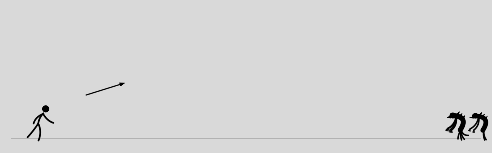
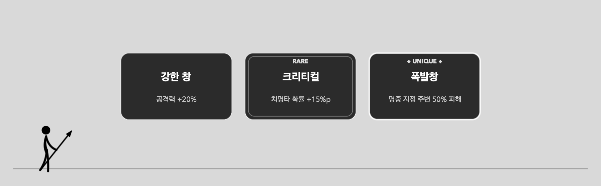
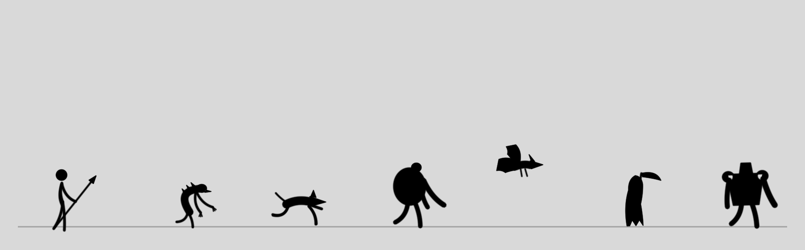
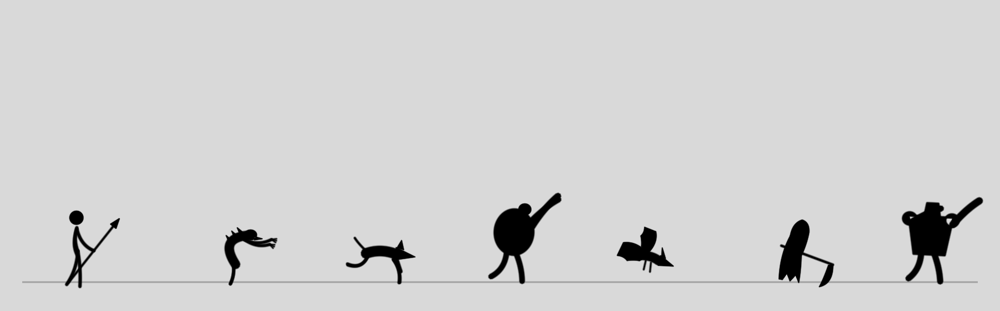

# TTALGAK (딸각)

**맥 독(Dock) 바로 위에 항상 떠 있는, 클릭 한 방의 창던지기 디펜스 게임.**

작업하다 심심할 때 화면 아래를 보면 스틱맨이 서 있다. 오른쪽에서 몬스터가 몰려온다. 클릭해서 창을 던져라. 딸각.



## 어떤 게임인가

- 투명한 게임 밴드가 독 위에 떠 있는 **데스크탑 상주형 미니 게임**
- 몰려오는 몬스터를 창으로 막는 **웨이브 디펜스** + 매 웨이브 능력을 고르는 **로그라이트 성장**
- 웨이브가 오를수록 몬스터는 강해지고 많아진다. 언젠가는 뚫린다 — 몇 웨이브까지 버티는가의 게임

## 게임 방법

1. **클릭 = 투척.** 클릭한 지점을 향해 창이 포물선으로 날아간다. 먼 적은 살짝 위를 조준할 것. 투척엔 쿨다운이 있다
2. 몬스터가 스틱맨에게 닿으면 체력이 깎인다. 체력이 다 떨어지면 게임 오버 — 클릭하면 재시작
3. 웨이브를 클리어하면 **카드 3장 중 1장 선택**. 등급이 있다:



- **일반** — 공격력, 공격속도, 회복 같은 수치 강화. 무한 중첩
- **레어** — 크리티컬, 파워샷(매 4번째 강화 투척), 쌍창(동시 2발), 관통, 냉기 창 같은 새 메커니즘
- **유니크** — 한 판에 한 번만 나오는 빌드 결정급: 폭발창, 번개 창(연쇄), 처형자(즉사), 불사조(1회 부활), 삼지창(동시 3발)…

4. 연속 처치하면 죽은 자리에 **콤보**가 뜬다. 끊기지 않게 유지해보자
5. **스페이스바** = 일시정지 · **우클릭** = 일시정지하고 게임 숨기기 (상태바 🎯 메뉴로 복귀)

메뉴는 상태바의 🎯 아이콘: 일시정지 · 숨기기/보이기 · 좌우 반전 · 흰색 테마(어두운 배경용) · 다시 시작 · 종료.

## 등장 몬스터



왼쪽부터: 플레이어, 그리고—

| | 이름 | 특징 |
|---|---|---|
| 하급 | **구울** | 기본 병력. 절뚝이며 꾸준히 온다 |
| 하급 | **하운드** | 네발로 질주. 2마리씩 몰려온다 |
| 하급 | **브루트** | 느리지만 단단하고 아프다 |
| 정예 | **와이번** | **공중을 난다** — 높이 조준해야 맞는다. 웨이브 5+ |
| 정예 | **리퍼** | 주기적으로 **순간이동**하며 접근. 웨이브 6+ |
| 정예 | **저거너트** | 넉백이 안 통하는 장갑 탱크. 웨이브 8+ |

정예는 웨이브당 소수만 나오지만, 후반으로 갈수록 늘어난다.



## 설치 & 실행

**[📦 Releases에서 다운로드](https://github.com/littleduck1219/TTALGAK/releases)** — macOS 13+ (TTALGAK.app) / Windows 10+ 64bit (TTALGAK.exe, 베타)

Windows: zip을 풀고 `TTALGAK.exe` 실행. 조작은 클릭=투척, Space=일시정지, 우클릭=최소화, F=좌우반전, T=테마, R=재시작, Esc=종료. SmartScreen 경고 시 "추가 정보 → 실행".

zip을 풀고 `TTALGAK.app`을 실행하면 끝. 서명되지 않은 앱이라 첫 실행 시 경고가 뜨면 **우클릭 → 열기** (또는 시스템 설정 → 개인정보 보호 및 보안 → "확인 없이 열기").

소스에서 직접 빌드하려면 (Xcode Command Line Tools 필요):

```bash
git clone https://github.com/littleduck1219/TTALGAK.git
cd TTALGAK
swift build -c release
.build/release/ttalgak
```

앱 번들 생성은 `./scripts/make_app.sh`.

## 개발자용

의존성 0의 Swift + AppKit + SpriteKit. 캐릭터는 스프라이트가 아니라 관절 뼈대 + 키포즈 보간의 절차 애니메이션이고, 밸런스 수치는 전부 [Config.swift](Sources/ttalgak/Config.swift)에 있다.

```bash
.build/debug/ttalgak --selftest          # 조준 풀이·포즈 보간 검증
.build/debug/ttalgak --snapshot <dir>    # 오프스크린 렌더 PNG
.build/debug/ttalgak --simulate 30       # 봇 자동 플레이 난이도 시뮬레이션
```
